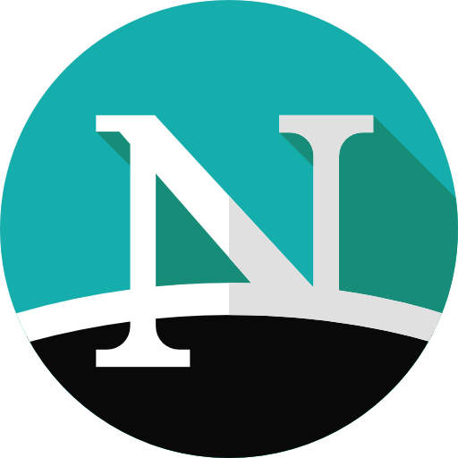

# SMX2-M8UF1A1-Netscape-ErickGutierrez
## ¿Que es?
### Netscape fue uno de los primeros navegadores más ingluyentes de los primero días de Internet. 

## ¿Quien lo creo?
|Origen|Foto del creador|
|------------------------|--------------------|
|Netscape fue creado por NCC (*Netscape Communications Corporation*), una compañia fundada por Marc Andreesen y Jim Clark.   ||

### *Marc Andreesen*
 Es un empresiorio e inversor de capital de riesgo, estadounidense conocido por su contribución significativa al desarrollo del *WWW*. Este señor nació el 9 de julio de 1971. Este fue el desarrollador del navegador Mosaic, mientras fue estudiante en el Universidad de Illions a principios de la década de 1990. Tambien es co-fundador de Netscape, junto a James H.Clark, Marc Andreessen co-fundó Netscape Communications.

### *James H.Clark*
Es un empresario y emprendedor estadounidense, conocido por ser una figura clave en el desarrollo de varias empresas tecnológicas exitosas. Fundó Silicon Graphics, Inc. (SGI), una empresa que se destacó en el desarrollo de estaciones de trabajo. Tambien como *Marc Andreesen*, James H.Clark es fundador en el Netscape Communications Coportion.

Este navegador ofrece varios servicios:
* *Netscape Navigator*: Fue uno de los primeros navegadores web comerciales y desempeñó un papel crucial en la popularización de Internet. 

* *Netscape Enterprise Server*: Era un servidor web de alto rendimiento utilizado por muchas empresas para alojar sus sitios web.

* *Netscape FastTrack Server*: Este servidor estaba diseñado para ser una solución más fácil de usar y estaba dirigido a pequeñas empresas y usuarios individuales.

* *Netscape Certificate Server*: Este servidor proporcionaba servicios de certificación digital y ayudaba en la implementación de tecnologías de seguridad, como SSL.